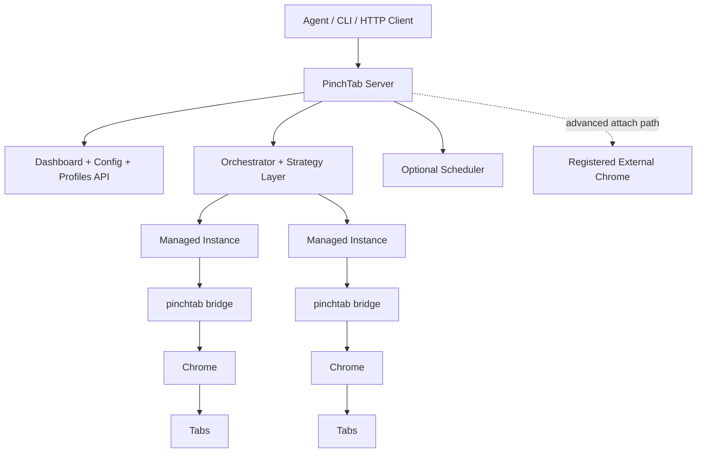
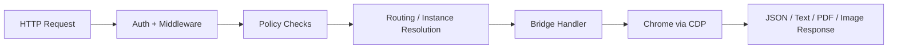

# 架构

PinchTab 是一个用于 Chrome 的本地 HTTP 控制平面，旨在实现代理驱动的浏览器自动化。调用者通过 HTTP 和 JSON 与 PinchTab 通信；PinchTab 通过 Chrome DevTools 协议将这些请求转换为浏览器操作。

## 运行时角色

PinchTab 有两个运行时角色：

- **服务器**：`pinchtab` 或 `pinchtab server`
- **桥接**：`pinchtab bridge`

目前，主要的生产形态是：

- **服务器** 管理配置文件、实例、路由和仪表板
- 每个管理实例都是一个独立的**桥接支持的**浏览器运行时
- 桥接拥有一个浏览器上下文并提供单实例浏览器 API

PinchTab 还支持高级附加路径：

- 服务器可以通过 `POST /instances/attach` 注册外部管理的 Chrome 实例
- 附加受 `security.attach.enabled`、`security.attach.allowHosts` 和 `security.attach.allowSchemes` 策略控制

当前的管理实现是桥接支持的。任何仅直接 CDP 的管理模型都在其他架构讨论中，不是此代码库中的默认运行时路径。

## 系统概述



## 请求流程

对于正常的多实例服务器路径，流程如下：



重要细节：

- 身份验证和通用中间件在 HTTP 层运行
- 策略检查包括附加策略以及启用时的 IDPI 保护
- 标签页范围的路由在执行前解析到所属实例
- 桥接运行时执行实际的 CDP 工作

在仅桥接模式下，跳过编排器和多实例路由层，但相同的浏览器处理程序模型仍然适用。

## 当前架构

当前实现围绕以下部分展开：

- **配置文件**：存储在磁盘上的持久浏览器状态
- **实例**：与配置文件或外部 CDP URL 关联的运行中浏览器运行时
- **标签页**：导航、提取和操作的主要执行表面
- **编排器**：启动、跟踪、停止和代理管理实例
- **桥接**：拥有浏览器上下文、标签页注册表、引用缓存和操作执行

实践中的主要实例类型有：

- 服务器启动的**管理桥接支持实例**
- 通过附加 API 注册的**附加外部实例**

## 安全和策略层

PinchTab 的保护逻辑位于 HTTP 处理程序层，不在调用者中，也不在 Chrome 本身中。

当启用 `security.idpi` 时，当前实现可以：

- 使用域策略阻止或警告导航目标
- 扫描 `/text` 输出中的常见提示注入模式
- 扫描 `/snapshot` 内容中的相同类型模式
- 配置时将 `/text` 输出包装在 `<untrusted_web_content>` 中

从架构上讲，这将策略与路由和执行分开：

```text
request -> middleware/policy -> routing -> execution -> response
```

## 设计原则

- **HTTP 用于调用者**：代理和工具通过 HTTP 与 PinchTab 通信，而不是原始 CDP
- **A11y 优先交互**：快照和引用是主要的结构化接口
- **实例隔离**：管理实例单独运行并保持隔离的浏览器状态
- **标签页范围执行**：一旦知道标签页，操作就路由到该标签页的所属运行时
- **可选协调层**：策略路由和调度器位于相同的浏览器执行表面之上

## 代码映射

当前架构中最重要的包是：

- `cmd/pinchtab`：进程启动模式和 CLI 入口点
- `internal/orchestrator`：实例生命周期、附加和标签页到实例的代理
- `internal/bridge`：浏览器运行时、标签页状态和 CDP 执行
- `internal/handlers`：单实例 HTTP 处理程序
- `internal/profiles`：持久配置文件管理
- `internal/strategy`：简写请求的服务器端路由行为
- `internal/scheduler`：可选的排队任务分发
- `internal/config`：运行时和文件配置加载