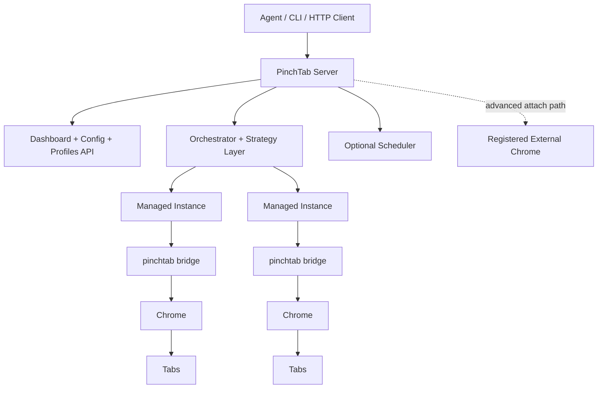
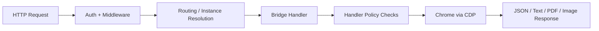

# 架构

PinchTab 是一个用于 Chrome 的本地 HTTP 控制平面，旨在实现代理驱动的浏览器自动化。调用者通过 HTTP 和 JSON 与 PinchTab 通信；PinchTab 通过 Chrome DevTools 协议将这些请求转换为浏览器操作。

## 运行时角色

PinchTab 有两个运行时角色：

- **服务器**：`pinchtab` 或 `pinchtab server`
- **桥接**：`pinchtab bridge`

目前，主要的生产形态是：

- **服务器** 管理配置文件、实例、路由和仪表板
- 每个受管实例都是一个独立的**桥接支持的**浏览器运行时
- 桥接拥有一个浏览器上下文并提供单实例浏览器 API

PinchTab 还支持一条高级附加（attach）路径：

- 服务器可以通过 `POST /instances/attach` 前置一个外部管理的 Chrome 实例（它针对该 CDP URL 启动一个子进程 `pinchtab bridge --cdp-attach`），或通过 `POST /instances/attach-bridge` 注册一个已在运行的桥接
- attach 受 `security.attach.enabled`、`security.attach.allowHosts` 和 `security.attach.allowSchemes` 策略门控

当前的受管实现是桥接支持的。任何仅直接 CDP 的受管模型都在别处作为架构讨论，不是本代码库中的默认运行时路径。

相关架构规约：

- [浏览器抽象](./browser-abstraction.md)：多浏览器目标模型，用于按请求选择 Chrome、CloakBrowser 及未来的 provider（见"目标架构"一节）。
- [地理 Provider](./geo-provider.md)：代理出口地理解析，包括拟议中未来基于 HTTP 的 provider 契约。

## 系统概述


```mermaid
flowchart TD
    A["Agent / CLI / HTTP Client"] --> S["PinchTab Server"]

    S --> D["Dashboard + Config + Profiles API"]
    S --> O["Orchestrator + Strategy Layer"]
    S --> Q["Optional Scheduler"]

    O --> M1["Managed Instance"]
    O --> M2["Managed Instance"]

    M1 --> B1["pinchtab bridge"]
    M2 --> B2["pinchtab bridge"]

    B1 --> C1["Chrome"]
    B2 --> C2["Chrome"]

    C1 --> T1["Tabs"]
    C2 --> T2["Tabs"]

    S -. "advanced attach path" .-> E["Registered External Chrome"]
```

## 请求流程

对于正常的多实例服务器路径，流程如下：


```mermaid
flowchart LR
    R["HTTP Request"] --> M["Auth + Middleware"]
    M --> X["Routing / Instance Resolution"]
    X --> B["Bridge Handler"]
    B --> P["Handler Policy Checks"]
    P --> C["Chrome via CDP"]
    C --> O["JSON / Text / PDF / Image Response"]
```

重要细节：

- 身份验证和通用中间件在 HTTP 层运行
- attach 策略在服务器的 attach 路由上强制实施
- 标签页范围的路由在执行前解析到所属实例
- 面向浏览器的检查（打开对话框守卫、域名策略，以及启用时的 IDPI）在桥接处理器中运行，先于任何 CDP 工作
- 桥接运行时执行实际的 CDP 工作

在仅桥接模式下，编排器和多实例路由层被跳过，但相同的浏览器处理器模型仍然适用。

## 当前架构

当前实现围绕以下部分展开：

- **配置文件（Profiles）**：存储在磁盘上的持久浏览器状态
- **实例（Instances）**：与配置文件或外部 CDP URL 关联的运行中浏览器运行时
- **标签页（Tabs）**：导航、提取和操作的主要执行表面
- **编排器（Orchestrator）**：启动、跟踪、停止和代理受管实例
- **桥接（Bridge）**：拥有浏览器上下文、标签页注册表、ref 缓存和动作执行

实践中的主要实例类型有：

- 服务器启动的**受管桥接支持实例**
- 通过 attach API 注册的**附加外部实例**

## 安全和策略层

PinchTab 的保护逻辑位于 HTTP 处理器层，不在调用者中，也不在 Chrome 本身中。

当启用 `security.idpi` 时，当前实现可以：

- 使用域名策略阻止或警告导航目标
- 扫描 `/text` 输出中的常见提示注入模式
- 扫描 `/snapshot` 内容中的相同类型模式
- 配置时将 `/text` 输出包装在 `<untrusted_web_content>` 中

从架构上讲，这将策略与路由和执行分开：

```text
request -> middleware -> routing -> handler policy -> execution -> response
```

## 设计原则

- **面向调用者的 HTTP**：代理和工具通过 HTTP 与 PinchTab 通信，而不是原始 CDP
- **A11y 优先交互**：快照和 ref 是主要的结构化接口
- **实例隔离**：受管实例单独运行并保持隔离的浏览器状态
- **标签页范围执行**：一旦知道标签页，动作就路由到该标签页的所属运行时
- **可选协调层**：策略路由和调度器位于相同的浏览器执行表面之上

## 代码映射

当前架构中最重要的包是：

- `cmd/pinchtab`：进程启动模式和命令行界面入口点
- `internal/orchestrator`：实例生命周期、attach，以及标签页到实例的代理
- `internal/instance`：标签页到实例的定位器缓存，以及编排器使用的实例分配
- `internal/bridge`：浏览器运行时、标签页状态和 CDP 执行
- `internal/browsers`：浏览器 provider 注册表（`chrome`、`cloak`、`ghost-chrome`）
- `internal/handlers`：单实例 HTTP 处理器
- `internal/profiles`：持久配置文件管理
- `internal/strategy`：简写请求的服务器端路由行为
- `internal/scheduler`：可选的排队任务分发
- `internal/config`：运行时和文件配置加载
