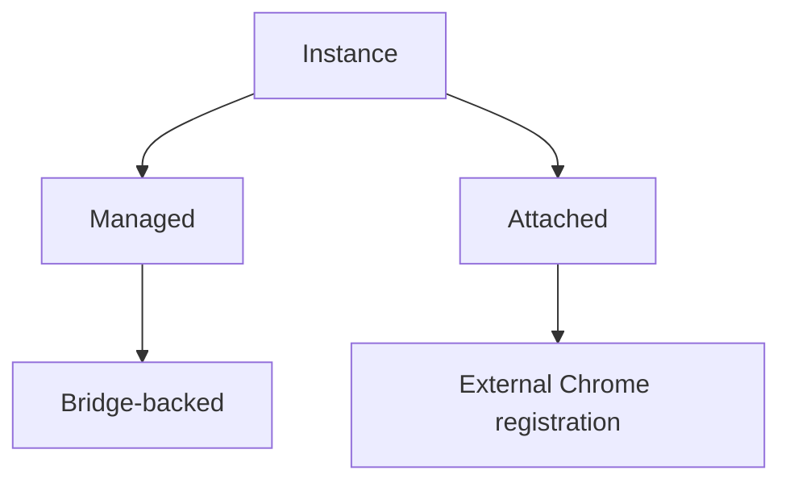
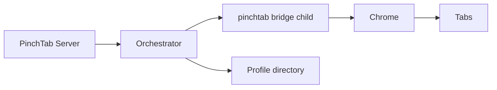
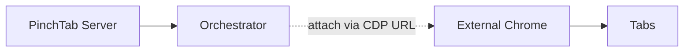
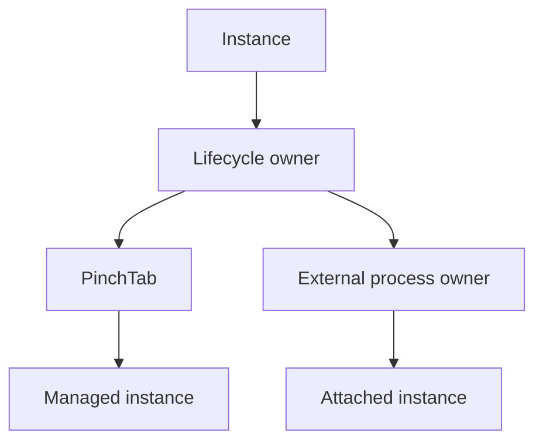
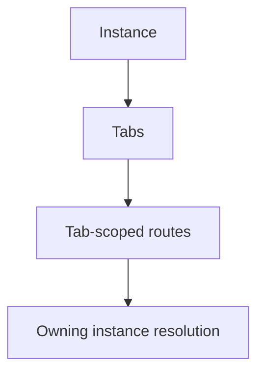

# 实例图表

本页捕获 PinchTab 中的当前实例模型。

它有意限制为代码库中现在存在的实例类型和关系。

## 图表 1：当前实例类型

当前含义：

- **managed** 意味着 PinchTab 启动并拥有运行时生命周期
- **attached** 意味着 PinchTab 注册一个已经运行的外部 Chrome
- **bridge-backed** 意味着服务器通过 `pinchtab bridge` 运行时到达浏览器

## 图表 2：管理实例形状

对于今天的管理实例：

- 编排器启动桥接子进程
- 桥接拥有一个浏览器运行时
- 标签页存在于该运行时内
- 浏览器状态与关联的配置文件目录绑定

## 图表 3：附加实例形状

对于今天的附加实例：

- PinchTab 不启动浏览器
- PinchTab 在实例注册表中存储注册元数据
- 外部浏览器进程的所有权保持在 PinchTab 之外
- 附加注册现在存在，但正常的管理实例标签页代理路径仍然以桥接支持的实例为中心

## 图表 4：所有权模型

这是关键区别：

- 管理实例的生命周期由 PinchTab 拥有
- 附加实例由 PinchTab 跟踪，但不由 PinchTab 拥有进程

## 图表 5：路由关系

重要的运行时规则是：

- 标签页属于一个实例
- 对于管理桥接支持的实例，标签页范围的服务器路由在代理之前解析到拥有实例

## 当前实例字段

当前 API 显示的主要实例字段是：

- `id`
- `profileId`
- `profileName`
- `port`
- `headless`
- `status`
- `startTime`
- `error`
- `attached`
- `cdpUrl`

有用的解释：

- `attached: false` 通常意味着管理桥接支持的实例
- `attached: true` 意味着外部注册的实例
- `port` 与管理桥接支持的实例相关
- `cdpUrl` 与附加实例相关