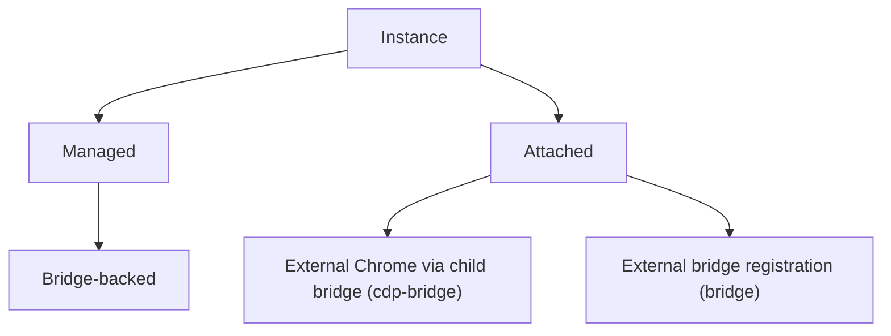
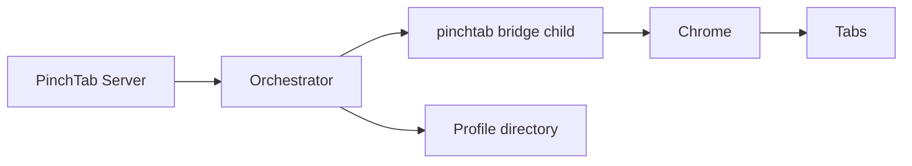
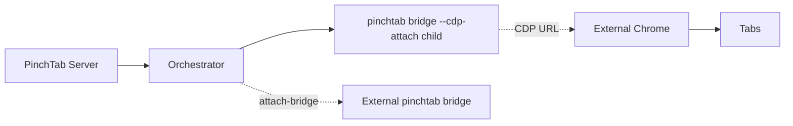
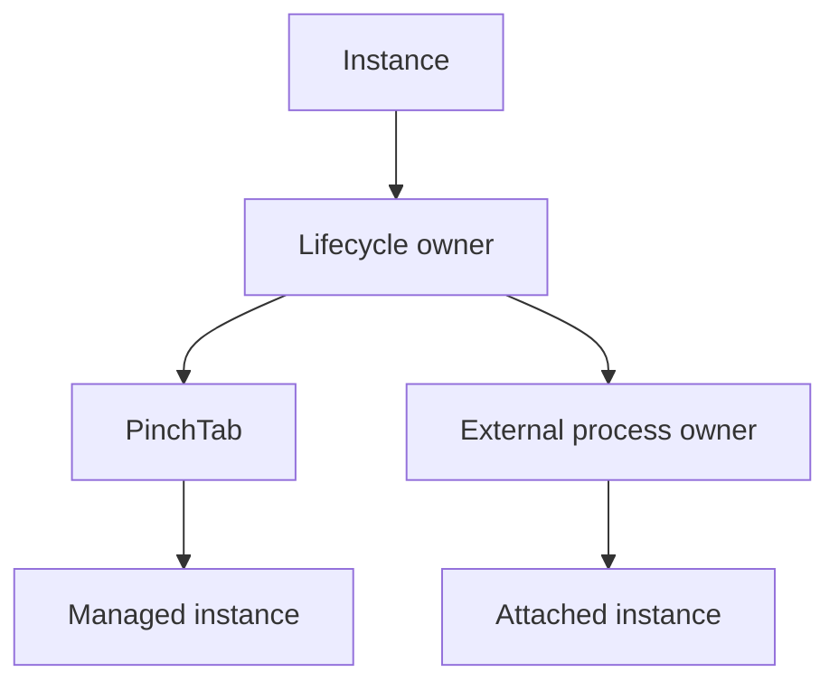
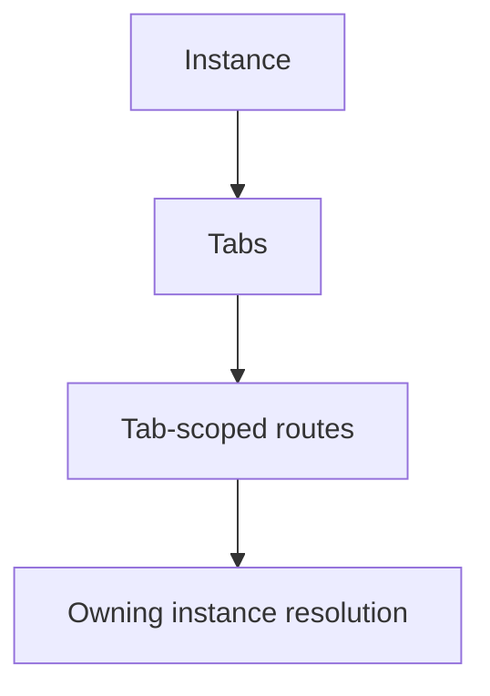

# 实例图表（Instance Charts）

本页记录 PinchTab 中当前的实例模型。

它有意限制为代码库中现在存在的实例类型和关系。

## 图 1：当前实例类型

```mermaid
flowchart TD
    I["Instance"] --> M["Managed"]
    I --> A["Attached"]

    M --> MB["Bridge-backed"]
    A --> EX["External Chrome via child bridge (cdp-bridge)"]
    A --> EB["External bridge registration (bridge)"]
```

当前含义：

- **managed** 意味着 PinchTab 启动并拥有运行时生命周期
- **attached** 意味着 PinchTab 前置一个它并未启动的对象：一个已在运行的外部 Chrome（`POST /instances/attach`，经由一个子进程 `pinchtab bridge --cdp-attach`），或一个已在运行的桥接服务器（`POST /instances/attach-bridge`）
- **bridge-backed** 意味着服务器通过一个 `pinchtab bridge` 运行时到达浏览器；这一点对每种实例类型都成立

## 图 2：受管实例形态

```mermaid
flowchart LR
    S["PinchTab Server"] --> O["Orchestrator"]
    O --> B["pinchtab bridge child"]
    B --> C["Chrome"]
    C --> T["Tabs"]
    O --> P["Profile directory"]
```

对于今天的受管实例：

- 编排器启动一个桥接子进程
- 桥接拥有一个浏览器运行时
- 标签页存在于该运行时内
- 浏览器状态与关联的配置文件目录绑定

## 图 3：附加实例形态

```mermaid
flowchart LR
    S["PinchTab Server"] --> O["Orchestrator"]
    O --> B["pinchtab bridge --cdp-attach child"]
    B -. "CDP URL" .-> E["External Chrome"]
    E --> T["Tabs"]
    O -. "attach-bridge" .-> XB["External pinchtab bridge"]
```

对于今天的附加实例：

- PinchTab 不启动浏览器
- 对于 CDP attach，PinchTab 启动并停止一个连接到外部浏览器的子桥接；对于 `attach-bridge`，它只注册远端桥接的 URL
- PinchTab 在实例注册表中存储注册元数据
- 外部浏览器进程的所有权保持在 PinchTab 之外
- 两种 attach 类型都暴露一个桥接 URL，因此标签页范围的路由以与受管实例相同的方式代理到它们

## 图 4：所有权模型

```mermaid
flowchart TD
    I["Instance"] --> L["Lifecycle owner"]

    L --> P["PinchTab"]
    L --> X["External process owner"]

    P --> M["Managed instance"]
    X --> A["Attached instance"]
```

这是关键区别：

- 受管实例的生命周期由 PinchTab 拥有
- 附加实例由 PinchTab 跟踪，但不由 PinchTab 拥有进程

## 图 5：路由关系

```mermaid
flowchart TD
    I["Instance"] --> T["Tabs"]
    T --> R["Tab-scoped routes"]
    R --> O["Owning instance resolution"]
```

重要的运行时规则是：

- 标签页属于一个实例
- 标签页范围的服务器路由在代理之前解析到所属实例，受管实例和附加实例皆然

## 当前实例字段

当前 API 暴露的主要实例字段是：

- `id`
- `profileId`
- `profileName`
- `port`
- `url`
- `mode`（`headless` 或 `headed`）
- `headless`
- `status`
- `startTime`
- `error`
- `attached`
- `attachType`（对附加实例为 `cdp-bridge` 或 `bridge`）
- `cdpUrl`
- `securityPolicy`
- `browser`
- `responsiveness`
- `crashes`、`fallbackFrom`、`fallbackReason`（存在时）

有用的解释：

- `attached: false` 通常意味着一个受管的桥接支持实例
- `attached: true` 意味着一个外部注册的实例
- `port` 与受管实例和 CDP 附加实例相关（子桥接的端口）
- `cdpUrl` 与 CDP 附加实例相关
