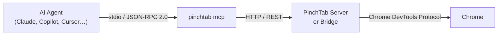

# MCP 服务器架构

本页描述了 PinchTab MCP 服务器的内部结构以及它如何与其余堆栈集成。

## 概述

MCP 服务器是一个基于 stdio 的 JSON-RPC 2.0 薄层。它作为单独的进程运行（`pinchtab mcp`），并通过其 REST API 将所有浏览器操作委托给已经运行的 PinchTab 实例。



关键设计决策：

- **无直接 Chrome 依赖** — MCP 进程没有 CDP 连接。所有浏览器工作都委托给 PinchTab 实例。
- **任何部署都有效** — 使用 `--server` 标志指向本地服务器、Docker 容器或远程主机。
- **无状态协议层** — MCP 服务器本身不持有浏览器状态；它纯粹是一个转换适配器。

## 传输

MCP 服务器使用 [MCP 规范 2025-11-25](https://spec.modelcontextprotocol.io/) 中定义的 **stdio 传输**。AI 客户端将 JSON-RPC 请求写入 stdin 并从 stdout 读取响应。日志和诊断信息发送到 stderr。

这种传输被 MCP 客户端（Claude Desktop、VS Code、Cursor 和任何基于 SDK 的客户端）普遍支持。

## 进程模型

```
pinchtab mcp
  │
  ├── reads config port     (default http://127.0.0.1:9867)
  ├── --server flag         (override for remote servers)
  ├── reads PINCHTAB_TOKEN  (env or config)
  │
  ├── creates internal/mcp.Client  (HTTP client with 120 s timeout)
  ├── registers 34 MCP tools via mcp-go SDK
  └── calls server.ServeStdio()  (blocking read loop)
```

当客户端关闭 stdin 时，进程退出。

## 代码布局

```
internal/mcp/
├── server.go      # NewServer() wires tools → handlers; Serve() starts stdio
├── tools.go       # allTools() — JSON-schema tool definitions for all 34 tools
├── handlers.go    # handlerMap() — one handler closure per tool
└── client.go      # Client — thin HTTP wrapper for PinchTab REST API

cmd/pinchtab/
└── cmd_mcp.go     # runMCP() — reads config, calls mcp.Serve()
```

### server.go

`NewServer` 通过 `mcp-go` SDK 创建 `MCPServer`，遍历 `allTools()`，在 `handlerMap` 中查找匹配的处理程序，并调用 `s.AddTool`。如果工具没有处理程序，启动时会触发 panic，防止静默缺口。

`Serve` 为正常执行路径包装 `server.ServeStdio`。

### tools.go

`allTools` 返回 `[]mcp.Tool` 切片。每个工具都使用以下内容声明：

- 名称 (`pinchtab_*`)
- 人类可读的描述，供 LLM 用于选择正确的工具
- 带有 `Required()` / `Description()` 注解的类型化参数模式

声明按类别分组：导航、交互、键盘、内容、标签页管理、等待工具、网络和对话框。

### handlers.go

每个处理程序都是一个工厂函数，返回 `func(context.Context, mcp.CallToolRequest) (*mcp.CallToolResult, error)` 闭包。处理程序：

1. 从 `r.GetArguments()` 提取并验证参数
2. 构建相应的 PinchTab REST 有效载荷
3. 使用请求上下文调用 `c.Get` 或 `c.Post`
4. 成功时返回 `mcp.NewToolResultText`，HTTP 4xx/5xx 时返回 `mcp.NewToolResultError`

从 MCP SDK 传递的上下文携带客户端的截止时间，因此如果客户端断开连接，长时间运行的导航将被取消。

### client.go

`Client` 包装 `net/http`，具有：

- 120 秒超时（覆盖页面加载和 PDF 导出）
- 可选的 `Authorization: Bearer <token>` 头部注入
- 10 MB 响应体限制
- `handleNavigate` 中的 URL 验证（必须以 `http://` 或 `https://` 开头）

## 工具类别

| 类别 | 数量 | 使用的 REST 端点 |
|----------|-------|---------------------|
| 导航 | 4 | `/navigate`, `/snapshot`, `/screenshot`, `/text` |
| 交互 | 8 | `/action` |
| 键盘 | 4 | `/action` |
| 内容 | 3 | `/evaluate`, `/pdf`, `/find` |
| 标签页管理 | 5 | `/tabs`, `/health`, `/cookies`, `/profiles/{id}/instance` |
| 等待工具 | 6 | `/wait` |
| 网络 | 3 | `/network` |
| 对话框 | 1 | `/dialog` |

## 安全考虑

- **`pinchtab_eval`** 调用 `/evaluate`，这需要 PinchTab 配置中的 `security.allowEvaluate: true`。默认情况下返回 HTTP 403。这是有意的 — 任意 JS 执行是与浏览器控制分开的选择加入功能。
- **URL 验证** — `pinchtab_navigate` 拒绝非 HTTP/HTTPS URL，以防止通过 `file://`、`javascript:` 或自定义方案进行 SSRF。
- **令牌转发** — MCP 客户端将配置的 bearer 令牌转发给 PinchTab，因此 PinchTab 层的访问控制适用于所有工具调用。
- **等待上限** — `pinchtab_wait` 和 `pinchtab_wait_for_selector` 强制执行 30 秒的最大值，以防止代理失控。

## 相关页面

- [MCP 用户指南](../mcp.md)
- [架构概述](./index.md)
- [MCP 工具参考](../reference/mcp-tools.md)
- [安全指南](../guides/security.md)