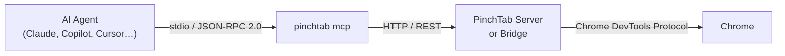

# MCP 服务器

本页描述 PinchTab MCP 服务器的内部结构以及它如何与其余堆栈集成。

## 概述

MCP 服务器是一个基于 stdio 的 JSON-RPC 2.0 薄层。它作为单独的进程运行（`pinchtab mcp`），并通过其 REST API 将每个浏览器操作委托给已经运行的 PinchTab 实例。


```mermaid
flowchart LR
    A["AI Agent\n(Claude, Copilot, Cursor…)"] -- "stdio / JSON-RPC 2.0" --> M["pinchtab mcp"]
    M -- "HTTP / REST" --> P["PinchTab Server\nor Bridge"]
    P -- "Chrome DevTools Protocol" --> C["Chrome"]
```

关键设计决策：

- **无直接 Chrome 依赖** — MCP 进程没有 CDP 连接。所有浏览器工作都委托给 PinchTab 实例。
- **任何部署都有效** — 使用 `--server` 标志指向本地服务器、Docker 容器或远程主机；非回环主机需要在 `PINCHTAB_TOKEN` 中提供自己的凭据（例如 `PINCHTAB_TOKEN=<token> pinchtab --server http://remote:9867 mcp`），因为本地配置的 `server.token` 绝不会被发送到本机之外。
- **无状态协议层** — MCP 服务器本身不持有浏览器状态；它纯粹是一个转换适配器。

## 传输

MCP 服务器使用 [MCP 规范 2025-11-25](https://spec.modelcontextprotocol.io/) 中定义的 **stdio 传输**。AI 客户端将 JSON-RPC 请求写入 stdin，并从 stdout 读取响应。日志和诊断信息发送到 stderr。

这种传输被 MCP 客户端（Claude Desktop、VS Code、Cursor 和任何基于 SDK 的客户端）普遍支持。

## 进程模型

```
pinchtab mcp
  │
  ├── reads config port     (default http://127.0.0.1:9867)
  ├── --server flag         (override for remote servers)
  ├── reads PINCHTAB_TOKEN  (env or config)
  ├── ensureServerForCLI    (auto-starts a local server when allowed)
  │
  ├── creates internal/mcp.Client  (HTTP client with 120 s timeout)
  ├── registers 47 MCP tools via mcp-go SDK
  └── calls server.ServeStdio()  (blocking read loop)
```

当客户端关闭 stdin 时，进程退出。

## 代码布局

```
internal/mcp/
├── server.go               # NewServer() wires tools → handlers; Serve() starts stdio
├── tools.go                # allTools() — JSON-schema tool definitions for all 47 tools
├── tools_params.go         # shared parameter builders (tabId, browser, snap, …)
├── tools_a11y.go           # a11y_audit tool + handler
├── tools_memory.go         # memory, memory_snapshot, memory_compare tools + handlers
├── handlers.go             # handlerMap() — wraps each tool's handler with argument checks
├── argcheck.go             # declared-argument + typed-argument validation from the tool schema
├── routing.go              # routedQuery/routedPath — puts `browser` where the router reads it
├── handlers_helpers.go     # shared argument parsing / response helpers
├── handlers_navigation.go  # navigate, back/forward/reload, snapshot, frame, screenshot, capture, get_text
├── handlers_interaction.go # click, type, hover, focus, select, scroll(_into_view), fill, key
├── handlers_content.go     # eval, pdf, find, extract
├── handlers_tabs.go        # list_tabs, close_tab, health, handoff/resume/handoff_status, cookies(_set), connect_profile
├── handlers_wait.go        # wait (fixed ms or selector/text/url/load/function condition)
├── handlers_network.go     # network, network_detail/clear/route/unroute/rules
├── handlers_diagnostics.go # console, errors
├── handlers_record.go      # record
├── handlers_scrape.go      # scrape
├── handlers_dialog.go      # dialog
└── client.go               # Client — thin HTTP wrapper for PinchTab REST API

cmd/pinchtab/
└── cmd_mcp.go     # runMCP() — reads config, calls mcp.Serve()
```

### server.go

`NewServer` 通过 `mcp-go` SDK 创建 `MCPServer`，遍历 `allTools()`，在 `handlerMap` 中查找匹配的处理器，并调用 `s.AddTool`。如果某个工具没有处理器，启动时会触发 panic，防止静默缺口。

`Serve` 为正常执行路径包装 `server.ServeStdio`。

### tools.go

`allTools` 返回一个 `[]mcp.Tool` 切片。每个工具都用以下内容声明：

- 名称（`pinchtab_*`）
- 供 LLM 选择正确工具时使用的人类可读描述
- 带 `Required()` / `Description()` 注解的类型化参数 schema

声明大致按类别排序：导航、交互、键盘、内容、标签页管理、等待工具、网络、诊断、对话框和抓取（Scrape）。

### handlers.go

每个处理器都是一个工厂函数，返回一个 `func(context.Context, mcp.CallToolRequest) (*mcp.CallToolResult, error)` 闭包。`handlerMap` 把每个处理器都包进 `withTypedArgChecks`，它先拒绝工具 schema 未声明的任何参数（并指出最接近的已声明参数），以及任何声明为 number/integer/boolean 但值类型错误的参数，在处理器运行之前就返回一个工具错误。处理器随后：

1. 从 `r.GetArguments()` 提取参数
2. 构建相应的 PinchTab REST 有效载荷
3. 用请求上下文调用 `c.Get` 或 `c.Post`
4. 成功时返回 `mcp.NewToolResultText`，HTTP 4xx/5xx 时返回 `mcp.NewToolResultError`

从 MCP SDK 传入的上下文携带客户端的截止时间，因此如果客户端断开连接，长时间运行的导航将被取消。

### client.go

`Client` 包装 `net/http`，具有：

- 120 秒超时（覆盖页面加载和 PDF 导出）
- 可选的 `Authorization: Bearer <token>` 头部注入
- 10 MB 响应体限制

URL 验证位于 `handleNavigate`（`handlers_navigation.go`）中，它调用 `internal/urls.Sanitize` 把裸主机名规范化为 `https://`，并拒绝非 HTTP(S) 的 scheme（`file://`、`javascript:` 等）。

## 工具类别

| 类别 | 数量 | 使用的 REST 端点 |
|----------|-------|---------------------|
| 导航 | 9 | `/navigate`, `/back`, `/forward`, `/reload`, `/snapshot`, `/frame`, `/screenshot`, `/capture`, `/text` |
| 交互 | 8 | `/action` |
| 键盘 | 1 | `/action` |
| 内容 | 4 | `/evaluate`, `/pdf`, `/find`, `/extract` |
| 标签页管理 | 9 | `/tabs`, `/close`, `/health`, `/tabs/{id}/handoff`, `/tabs/{id}/resume`, `/cookies`, `/profiles/{name}/instance` |
| 等待工具 | 1 | `/wait` |
| 网络 | 6 | `/network`, `/network/{requestId}`, `/network/clear`, `/tabs/{id}/network/route` (POST/GET/DELETE) |
| 诊断 | 7 | `/console`, `/errors`, `/record/*`, `/a11y/audit`, `/memory`, `/memory/snapshot`, `/memory/compare` |
| 对话框 | 1 | `/dialog` |
| 抓取 | 1 | `/scrape` |

## 安全考虑

- **`pinchtab_eval`** 调用 `/evaluate`，这需要 PinchTab 配置中的 `security.allowEvaluate: true`。它默认返回 HTTP 403。这是有意的——任意 JS 执行是与浏览器控制分开的选择加入功能。
- **`pinchtab_cookies`** 和 **`pinchtab_cookies_set`** 调用 `/cookies`，这需要 `security.allowCookies: true`。cookie 值可能暴露会话凭据，而设置一个 cookie 就等于授予一个会话，因此 cookie 操作默认禁用。
- **URL 验证** — `pinchtab_navigate` 拒绝非 HTTP/HTTPS URL，以防止通过 `file://`、`javascript:` 或自定义 scheme 进行 SSRF。
- **令牌转发** — MCP 客户端把配置的 bearer 令牌转发给 PinchTab，因此 PinchTab 层的访问控制适用于所有工具调用。
- **等待上限** — `pinchtab_wait` 对固定的 `for=ms` 睡眠以及每个由浏览器支撑的条件的 `timeoutMs` 都强制执行 30 秒最大值，以防止代理失控。

## 相关页面

- [MCP 用户指南](../mcp.md)
- [架构概述](./index.md)
- [MCP 工具参考](../reference/mcp-tools.md)
- [安全指南](../guides/security.md)
