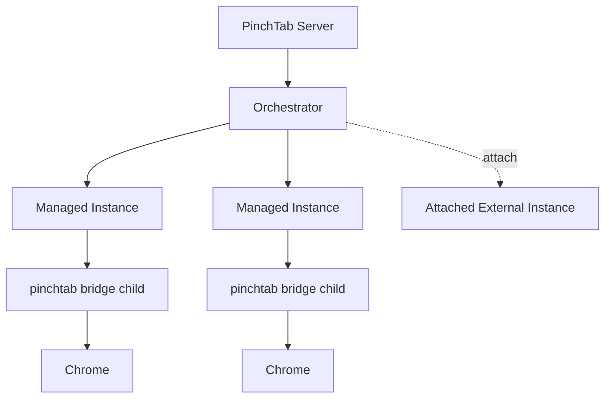
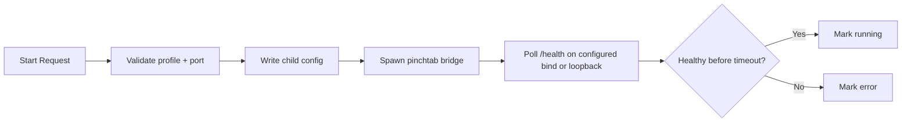
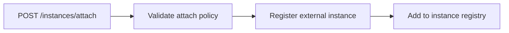
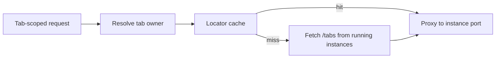
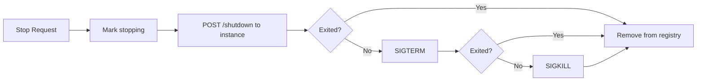

# 编排

本页描述了 PinchTab 中的当前编排层：服务器如何启动、跟踪、路由到和停止浏览器实例。

## 范围

编排器是服务器模式的一部分。它负责：

- 作为子 `pinchtab bridge` 进程启动管理实例
- 当附加策略允许时，附加外部管理的 Chrome 实例
- 跟踪实例状态和元数据
- 将标签页范围的请求路由到拥有的管理实例
- 停止管理实例并清理注册表状态

它不直接执行浏览器操作。这项工作在桥接运行时内部进行。

## 当前运行时形状

## 启动流程

对于管理实例，编排流程如下：

代码现在的功能：

- 在启动前验证配置文件名称
- 当未提供端口时分配端口
- 防止每个配置文件有多个活动管理实例
- 防止重用已使用的端口
- 在配置文件状态目录下写入子配置文件
- 启动 `pinchtab bridge`
- 首先在配置的子绑定上轮询 `/health`（如果存在），然后回退到 `127.0.0.1`、`::1` 和 `localhost`
- 将实例从 `starting` 移动到 `running` 或 `error`

## 附加流程

附加是已运行浏览器的单独路径。

当前附加行为：

- 需要 `security.attach.enabled`
- 根据 `security.attach.allowSchemes` 验证 CDP URL
- 根据 `security.attach.allowHosts` 验证主机
- 将实例注册为 `attached: true`
- 不启动或停止外部 Chrome 进程

## 路由模型

编排器也是多实例服务器模式的路由层。

今天，标签页路由的工作方式如下：

- 对于 `/tabs/{id}/navigate` 和 `/tabs/{id}/action` 等路由，服务器解析哪个实例拥有标签页
- 它首先尝试实例定位器缓存
- 缓存未命中时，回退到通过 `/tabs` 扫描运行中的实例
- 解析后，它将请求代理到拥有的桥接实例

这保持了公共服务器 API 的稳定性，同时桥接实例保持隔离。

重要限制：

- 此路由路径完全围绕暴露环回 HTTP 端口的管理桥接支持实例构建
- 附加实例在实例注册表中注册和显示，但正常的标签页所有者代理路径尚未对它们同样成为一等公民

## 停止流程

停止管理实例是服务器拥有的生命周期操作。

当前停止行为：

- 将实例标记为 `stopping`
- 尝试通过实例 HTTP API 进行优雅关闭
- 必要时回退到进程组终止
- 释放分配的端口
- 从注册表和定位器缓存中删除实例

对于附加实例，没有子进程可杀死；编排器仅删除其自己的注册状态。

## 实例状态

今天显示的主要状态是：

- `starting`
- `running`
- `stopping`
- `stopped`
- `error`

编排器还发出生命周期事件，例如：

- `instance.started`
- `instance.stopped`
- `instance.error`
- `instance.attached`

## 与其他层的关系

- **策略层** 决定在服务器模式中如何暴露或路由简写请求
- **调度器** 是可选的，位于相同的路由执行路径之上
- **桥接** 拥有浏览器状态、标签页状态和 CDP 执行
- **配置文件** 在磁盘上提供持久的浏览器数据