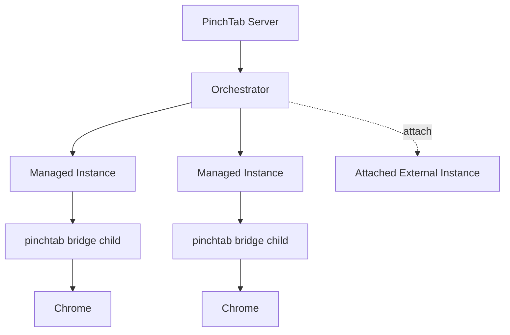
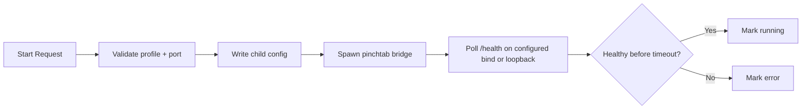
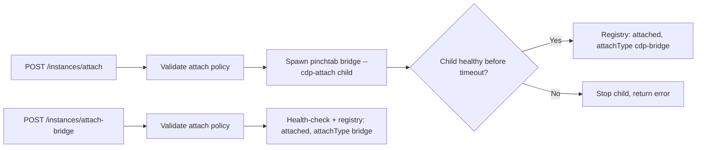
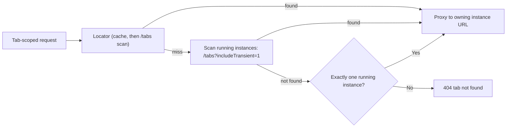
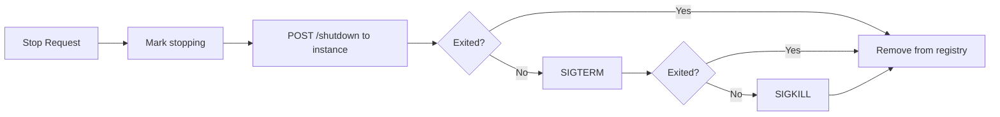

# 编排（Orchestration）

本页描述 PinchTab 中当前的编排层：服务器如何启动、跟踪、路由到和停止浏览器实例。

## 范围

编排器是服务器模式的一部分。它负责：

- 作为子 `pinchtab bridge` 进程启动受管实例
- 在附加策略允许时附加外部管理的 Chrome 实例
- 跟踪实例状态和元数据
- 将标签页范围的请求路由到所属的受管实例
- 停止受管实例并清理注册表状态

它不直接执行浏览器操作。这项工作在桥接运行时内部进行。

## 当前运行时形态

```mermaid
flowchart TD
    S["PinchTab Server"] --> O["Orchestrator"]

    O --> M1["Managed Instance"]
    O --> M2["Managed Instance"]
    O -.->|attach| A1["Attached External Instance"]

    M1 --> B1["pinchtab bridge child"]
    M2 --> B2["pinchtab bridge child"]

    B1 --> C1["Chrome"]
    B2 --> C2["Chrome"]
```

## 启动流程

对于受管实例，编排流程如下：

```mermaid
flowchart LR
    R["Start Request"] --> V["Validate profile + port"]
    V --> W["Write child config"]
    W --> P["Spawn pinchtab bridge"]
    P --> H["Poll /health on configured bind or loopback"]
    H --> S{"Healthy before timeout?"}
    S -->|Yes| OK["Mark running"]
    S -->|No| ER["Mark error"]
```

代码现在的功能：

- 在启动前验证配置文件名称
- 当未提供端口时分配端口
- 防止每个配置文件有多个活动受管实例
- 防止重用已使用的端口
- 在配置文件状态目录下写入子配置文件
- 启动 `pinchtab bridge`
- 首先在配置的子绑定上轮询 `/health`（如果存在），然后回退到 `127.0.0.1`、`::1` 和 `localhost`
- 将实例从 `starting` 移动到 `running` 或 `error`

## 附加流程

附加是一条针对已在运行的浏览器或桥接的单独路径。

```mermaid
flowchart LR
    R["POST /instances/attach"] --> P["Validate attach policy"]
    P --> B["Spawn pinchtab bridge --cdp-attach child"]
    B --> H{"Child healthy before timeout?"}
    H -->|Yes| L["Registry: attached, attachType cdp-bridge"]
    H -->|No| X["Stop child, return error"]
    RB["POST /instances/attach-bridge"] --> PB["Validate attach policy"]
    PB --> LB["Health-check + registry: attached, attachType bridge"]
```

当前附加行为：

- 需要 `security.attach.enabled`
- 根据 `security.attach.allowSchemes` 验证 URL
- 根据 `security.attach.allowHosts` 验证主机
- `POST /instances/attach`（CDP URL）在一个分配的端口上启动一个子进程 `pinchtab bridge --cdp-attach <url>`，等待其 `/health`，并将其注册为 `attached: true`、`attachType: "cdp-bridge"`
- `POST /instances/attach-bridge` 将一个已在运行的桥接服务器注册为 `attachType: "bridge"`（当令牌匹配时按名称 upsert）
- 绝不启动或杀死外部 Chrome 进程本身

## 路由模型

编排器也是多实例服务器模式的路由层。

```mermaid
flowchart LR
    R["Tab-scoped request"] --> C["Locator (cache, then /tabs scan)"]
    C -->|found| P["Proxy to owning instance URL"]
    C -->|miss| F["Scan running instances: /tabs?includeTransient=1"]
    F -->|found| P
    F -->|not found| S{"Exactly one running instance?"}
    S -->|Yes| P
    S -->|No| N["404 tab not found"]
```

今天，标签页路由（`internal/orchestrator/route.go` 中的 `routeByTabOwner`）是这样工作的：

- 对于 `/tabs/{id}/navigate` 和 `/tabs/{id}/action` 等路由，服务器解析哪个实例拥有该标签页
- 它先询问实例定位器（`internal/instance`），后者检查其标签页→实例缓存，未命中时扫描每个运行中实例的面向用户的 `/tabs` 列表
- 如果仍未命中，编排器用 `/tabs?includeTransient=1` 扫描运行中实例，即那个未过滤的列表，它还包含 UI 列表隐藏的标签页（例如 `about:blank`、`file://` 或实例自身的端口），并把所属者记录在定位器中
- 如果找不到所属者且恰好有一个实例在运行，请求落到它；否则返回 404
- 与所属者浏览器冲突的 `browser` 在代理之前被拒绝
- 解析后，它将请求代理到所属实例的 URL

不带标签页 id 的请求会转到绑定到调用者会话或代理身份的实例（如果存在），否则转到活动策略的回退目标，即匹配所请求或默认浏览器的最早启动的运行中实例（`simple` 策略在没有实例运行时启动一个）。当未请求浏览器时，那就是 `/health` 报告为 `defaultInstance` 的同一个实例（`DefaultInstance()`）。

这保持了公共服务器 API 的稳定性，同时桥接实例保持隔离。附加实例（两种 attach 类型）都暴露一个桥接 HTTP URL，因此它们使用相同的代理路径。

## 停止流程

停止受管实例是服务器拥有的生命周期操作。

```mermaid
flowchart LR
    R["Stop Request"] --> S["Mark stopping"]
    S --> G["POST /shutdown to instance"]
    G --> W{"Exited?"}
    W -->|No| T["SIGTERM"]
    T --> K{"Exited?"}
    K -->|No| X["SIGKILL"]
    W -->|Yes| D["Remove from registry"]
    K -->|Yes| D
    X --> D
```

当前停止行为：

- 将实例标记为 `stopping`
- 尝试通过实例 HTTP API 进行优雅关闭
- 必要时回退到进程组终止
- 释放分配的端口
- 从注册表和定位器缓存中删除实例

对于 CDP 附加实例，子桥接以相同方式停止；外部 Chrome 保持运行。对于 `attach-bridge` 实例，没有子进程：编排器向已注册的桥接发送 `POST /shutdown`，等待其端点消失，然后删除注册。

## 实例状态

今天暴露的主要状态是：

- `starting`
- `running`
- `stopping`
- `stopped`
- `error`

编排器还发出生命周期事件，例如：

- `instance.launched`
- `instance.started`
- `instance.stopped`
- `instance.error`
- `instance.attached`
- `instance.reattached`

`Orchestrator.List()` 返回按启动时间排序的实例（平局按 ID 打破），因此多次调用之间的列表是稳定的。

## 与其他层的关系

- **策略层** 决定在服务器模式中如何暴露或路由简写请求
- **调度器** 是可选的，位于相同的路由执行路径之上
- **桥接** 拥有浏览器状态、标签页状态和 CDP 执行
- **配置文件** 在磁盘上提供持久的浏览器数据
