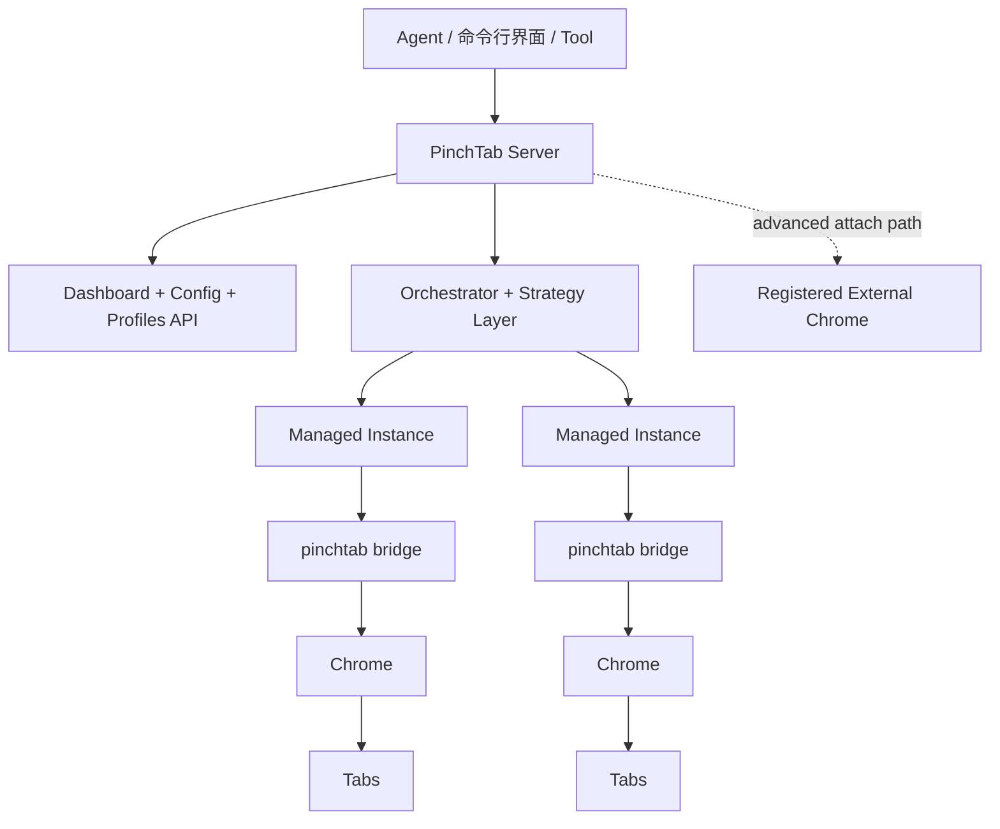
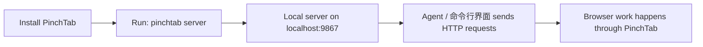
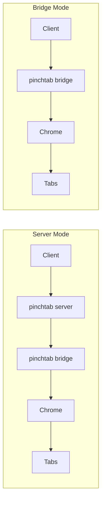
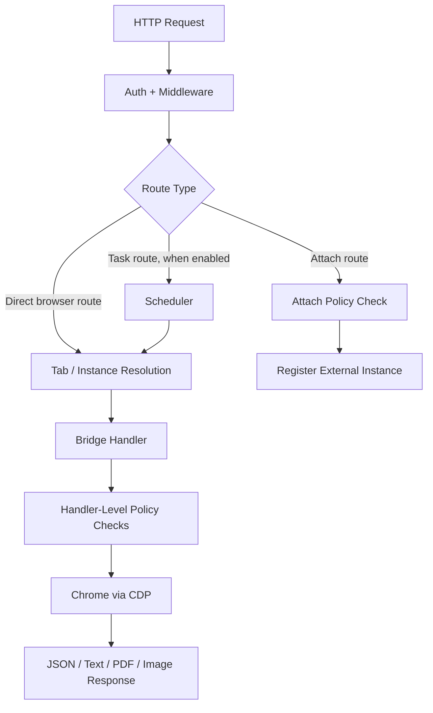

# 系统图表

本页收集了当前 PinchTab 架构的主要高级图表。

## 图表 1：产品形状

这是今天的默认系统形状：

- 代理通过 HTTP 与服务器通信
- 服务器管理配置文件、实例和路由
- 管理实例由桥接支持
- 附加作为高级外部浏览器注册路径存在

## 图表 2：主要使用路径

这是用户的正常心智模型。大多数用户应该考虑 `pinchtab server`，而不是 `pinchtab bridge`。

## 图表 3：运行时形状

含义：

- **服务器模式** 是多实例控制平面路径
- **桥接模式** 是单实例浏览器运行时

## 图表 4：当前请求路径

重要细节：

- 身份验证和共享中间件在 HTTP 层运行
- 附加策略在服务器的附加路由上强制执行
- IDPI 和类似的面向浏览器的检查在导航、文本和快照等处理程序中运行
- 标签页范围的路由在执行前解析到拥有实例
- 调度器是可选的，仅服务器端，适用于 `/tasks`
- 桥接处理程序执行实际的浏览器工作