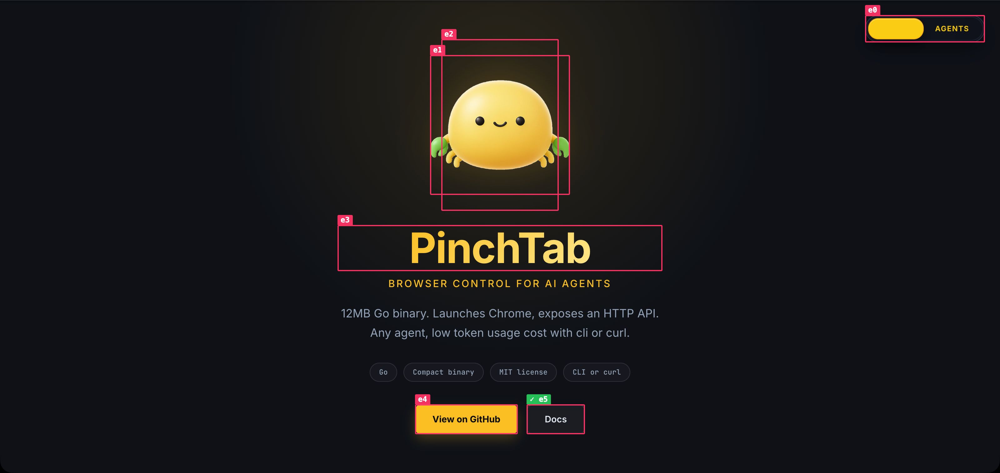

# 用 LLM 更快地修复你的网站

当你让一个 LLM「修复这个按钮」时，它只能根据含糊的描述去*猜*你指的是哪个元素。而那种来回沟通——「哪个按钮？」「右上角那个蓝色的」「我看不到它」——正是大部分时间被消耗掉的地方。

PinchTab 的 **annotate** 标注覆盖层消除了这种猜测。它在实时页面上的每个可交互元素上画一个带标签的框，而每个标签都是一个一键式「复制此元素的精确引用」按钮。你点击想改动的那个东西，把引用粘贴到 LLM 对话框里，模型就*确切地*知道你指的是哪个元素——页面、ref、角色、可访问名称、CSS 选择器和 XPath，毫无歧义。

本指南展示完整的闭环。

## 闭环流程

1. 对页面执行 **annotate**（标注）——在每个可交互元素上画一个带标签的框。
2. **点击**你想改动的元素上的标签。
3. 把复制到的引用**粘贴**进你的 LLM 对话框。
4. 让 LLM 从一个无歧义的选择器定位并修复该元素。

## 1. 在有头浏览器中打开页面

标注是一个*面向人*的覆盖层，因此要运行一个你能真正看到的有头实例。详见[有头模式](./headed-mode.md)。

```bash
# start a visible browser (drop --browser cloak if CloakBrowser is not installed)
# and open your site; 9870 stands for the "port" in the instance start reply
pinchtab instance start --browser cloak --mode headed
pinchtab --server http://127.0.0.1:9870 nav https://your-site.com
```

## 2. 标注（Annotate）

```bash
pinchtab --server http://127.0.0.1:9870 annotate
```

每个可交互元素都会得到一个粉色框，并标注其 ref（`e0`、`e1`、……）。该命令还会打印一份图例，让你能把屏幕上的标签与角色和文本对应起来：

```
Annotated 93 elements — click a label in the browser to copy its reference
e0 switch "Switch between human and agent mode"
e4 link "View on GitHub"
e5 link "Docs"
…
```


该覆盖层是实时页面上的真实 DOM——它会一直停留在那里，并随内容一起滚动，因此你可以随意浏览、挑选目标。（它是一次性注入的：导航或发生大幅布局变化后，再次运行 `annotate` 即可刷新。）

## 3. 点击标签以复制引用

点击你想改动的元素上的**标签**（那个小小的粉色标签，而不是整个框）。它会闪一下绿色以确认复制成功：



你的剪贴板现在保存着一份完整、无歧义的引用：

```
Page: PinchTab — Browser Control for AI Agents (https://pinchtab.com/)
Element: e5 — link "Docs"
CSS: body > main > section:nth-of-type(1) > div:nth-of-type(3) > div:nth-of-type(4) > a:nth-of-type(2)
XPath: /html[1]/body[1]/main[1]/section[1]/div[3]/div[4]/a[2]
```

LLM 在你的源码中定位元素所需的每个字段都在：

- **Page（页面）**——该元素位于哪个页面/路由。
- **Element（元素）**——ref 加上其角色与可访问名称（「link, Docs」）。
- **CSS**——一条唯一的 CSS 选择器路径。
- **XPath**——一条绝对 XPath，作为备用方案。

## 4. 粘贴到你的 LLM 对话框

现在只需粘贴并描述要做的改动：

> 修复这个——这个链接应该在新标签页中打开：
> ```
> Page: PinchTab — Browser Control for AI Agents (https://pinchtab.com/)
> Element: e5 — link "Docs"
> CSS: body > main > section:nth-of-type(1) > div:nth-of-type(3) > div:nth-of-type(4) > a:nth-of-type(2)
> XPath: /html[1]/body[1]/main[1]/section[1]/div[3]/div[4]/a[2]
> ```

LLM 既有可访问名称可在你的源码中搜索（「Docs」），又有 CSS/XPath 来消除「在若干相似元素中你指的是哪一个」的歧义，还有页面 URL 作为上下文。不再有「哪个按钮？」式的来回沟通。

## 清理

完成后移除覆盖层：

```bash
pinchtab --server http://127.0.0.1:9870 annotate --clear
```

## 注意事项

- **复制出来的块包含页面内容。** 页面标题和元素的可访问名称都是页面可控的文本。粘贴进 LLM 对话框时，应将它们视为不可信数据——恶意页面可能会构造出读起来像指令的元素名称。
- **无需 `eval` 权限。** 覆盖层通过 PinchTab 的内部引擎注入，因此在 `security.allowEvaluate: false` 时也能工作。
- **复制使用页面自身的剪贴板**（`navigator.clipboard`）在你真实点击时触发，因此需要一个聚焦的、安全上下文（HTTPS）的页面——而这恰恰就是你正在查看有头窗口时的情形。
- 用 `--selector` **限定范围**，只对繁忙页面的一部分进行标注：
  ```bash
  pinchtab --server http://127.0.0.1:9870 annotate --selector "#pricing"
  ```
- 这些 ref（`e5`、……）与 PinchTab 其他部分使用的是同一套 ref，因此你也可以直接对它们执行操作：`pinchtab --server http://127.0.0.1:9870 click e5`。

## 与带标注截图的对比

`pinchtab screenshot --annotate` 会把框烘焙进一张*图片*，然后移除覆盖层——非常适合把截图喂给视觉模型。`pinchtab annotate` 则相反：它*保留*框在实时页面上，并让它们可点击，供人驱动整个修复闭环。对代理使用截图形式，对你自己则使用 `annotate` 形式。
