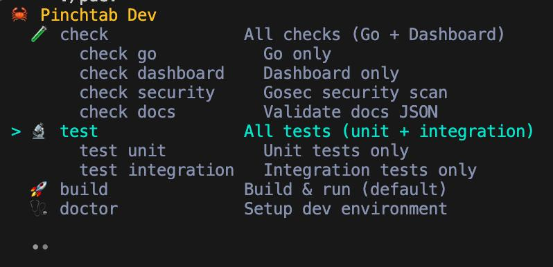

# 贡献指南

这是 PinchTab 的权威贡献者与开发指南。

## 系统要求

### 最低要求

| 要求 | 版本 | 用途 |
|------------|---------|---------|
| Go | 1.26+（`go.mod`） | 构建语言 |
| golangci-lint | 最新版 | 代码检查（pre-commit 钩子必需） |
| Chrome/Chromium | 最新版 | 浏览器自动化 |
| macOS、Linux 或 WSL2 | 当前版本 | 操作系统支持 |

做仪表板相关工作时，请使用 Bun 1.2+。
较旧的 Bun 版本在使用 `--frozen-lockfile` 进行干净安装时，会在已签入的 `dashboard/bun.lock` 上失败。

### 推荐设置

- **macOS**：使用 Homebrew 进行包管理
- **Linux**：apt（Debian/Ubuntu）或 yum（RHEL/CentOS）
- **WSL2**：完整的 Linux 环境（非 WSL1）

---

## 快速开始

**最快的上手方式：**

```bash
# 1. Clone
git clone https://github.com/pinchtab/pinchtab.git
cd pinchtab

# 2. Run doctor (verifies environment, prompts before installing anything)
./dev doctor

# 3. Build and run
go build ./cmd/pinchtab
./pinchtab server
```

**示例输出：**
```
  🦀 Pinchtab Doctor
  Verifying and setting up development environment...

Go Backend
  ✓ Go 1.26.0
  ✗ golangci-lint
    Required for pre-commit hooks and CI.
    Install golangci-lint via brew? [y/N] y
    ✓ golangci-lint installed
  ✓ Git hooks
  ✓ Go dependencies

Dashboard (React/TypeScript)
  ✓ Node.js 22.15.1
  · Bun not found
    Optional — used for fast dashboard builds.
    Install Bun? [y/N] n
    curl -fsSL https://bun.sh/install | bash

Summary

  · 1 warning(s)
```

doctor 在安装任何东西之前都会请求确认。
如果你拒绝，它会改为显示手动安装命令。

---

## 第一部分：先决条件

### 安装 Go

**macOS（Homebrew）：**
```bash
brew install go
go version  # Verify: go1.26.0 or newer
```

**Linux（Ubuntu/Debian）：**
```bash
sudo apt update
sudo apt install -y golang-go git build-essential
go version
```

**Linux（RHEL/CentOS）：**
```bash
sudo yum install -y golang git
go version
```

**或从这里下载：** https://go.dev/dl/

### 安装 golangci-lint（必需）

pre-commit 钩子必需：

**macOS/Linux：**
```bash
brew install golangci-lint
```

**或通过 Go 安装：**
```bash
go install github.com/golangci/golangci-lint/cmd/golangci-lint@latest
```

验证：
```bash
golangci-lint --version
```

### 安装 gotestsum（推荐）

推荐使用它，以便获得 `./dev test unit` 所使用的更干净的本地单元测试输出：

```bash
go install gotest.tools/gotestsum@latest
```

### 安装 Chrome/Chromium

**macOS（Homebrew）：**
```bash
brew install chromium
```

**Linux（Ubuntu/Debian）：**
```bash
sudo apt install -y chromium-browser
```

**Linux（RHEL/CentOS）：**
```bash
sudo yum install -y chromium
```

### 自动化设置

克隆之后，运行 doctor 来验证并设置你的环境：

```bash
git clone https://github.com/pinchtab/pinchtab.git
cd pinchtab
./dev doctor
```

doctor 会检查你的环境，并在**安装任何东西之前询问**：
- Go 1.26+ 和 golangci-lint（提供 `brew install` 或 `go install`）
- Git 钩子（复制 pre-commit 钩子）
- Go 依赖（`go mod download`）
- Node.js、Bun 和仪表板依赖（可选，用于仪表板开发）

随时运行 `./dev doctor` 即可验证或修复你的环境。

---

## 第二部分：构建项目

### 简单构建

```bash
go build -o pinchtab ./cmd/pinchtab
```

**它会做什么：**
- 编译 Go 源代码
- 产出二进制：`./pinchtab`
- 大约需要 30–60 秒

> **注意：** 这只构建 Go 服务器。仪表板会显示一个
> 「not built」占位符。要包含完整的 React 仪表板，请改用
> `./dev build`——它一步到位地构建仪表板、编译 Go 并
> 运行服务器。或者在 `go build` 之前先运行 `./scripts/build-dashboard.sh`。

**验证：**
```bash
ls -la pinchtab
./pinchtab --version
```

---

## 第三部分：运行服务器

### 启动（无头）

```bash
./pinchtab server
```

服务器监听 `127.0.0.1:9867`，并在每个请求上要求来自你配置的 `server.token`（`./pinchtab config token --stdout` 会打印它）。加 `-v` 可看到完整的启动横幅。

### 启动（有头模式）

```bash
./pinchtab server --headed
```

为默认实例在前台打开 Chrome。

### 后台运行

```bash
./pinchtab server --background        # spawns detached, prints JSON with pid/url/token
./pinchtab server -b                  # short form
```

`--background` flag 会 fork 一个正确分离的服务器进程，并在 stdout 上返回 `{"pid": ..., "url": ..., "token": ...}`，因此脚本可以直接捕获 URL/token，无需抓取日志。对于更长期运行的安装，请改用 `pinchtab daemon install`。

---

## 第四部分：快速测试

### 健康检查

```bash
./pinchtab health
# or, with the token:
curl -H "Authorization: Bearer $(./pinchtab config token --stdout)" http://localhost:9867/health
```

### 试试 CLI

```bash
./pinchtab nav https://pinchtab.com --snap
./pinchtab snap
```

---

## 开发

### 运行测试

```bash
go test ./...                              # Unit tests only
go test ./... -v                           # Verbose
go test ./... -v -coverprofile=coverage.out
go tool cover -html=coverage.out           # View coverage
./dev e2e                                 # Run the default extended E2E suite
./dev e2e basic                           # Run API + CLI + Infra basic tests
./dev e2e smoke                           # Run CI smoke scenarios + host Docker smoke checks
./dev smoke                               # Run all local smoke categories
./dev smoke --browser=cloak              # Run all local CloakBrowser smoke categories
./dev e2e api                             # Run API basic tests
./dev e2e cli                             # Run CLI basic tests
./dev e2e infra                           # Run Infra basic tests
./dev e2e api-extended                    # Run API extended (multi-instance)
./dev e2e cli-extended                    # Run CLI extended tests
./dev e2e infra-extended                  # Run Infra extended (multi-instance)
```

### 开发者工具包（`dev`）

所有开发脚本都可通过 `./dev` 访问：

```bash
./dev              # Interactive picker (uses gum if installed, numbered fallback)
./dev check        # Run a command directly
./dev test unit    # Subcommands supported
./dev --help       # List all commands
```



**可用命令：**

| 命令 | 描述 |
|---------|-------------|
| `check` | 全部检查（Go + 仪表板） |
| `check go` | 仅 Go 检查 |
| `check dashboard` | 仅仪表板检查 |
| `check security` | Gosec 安全扫描 |
| `check docs` | 校验文档 JSON |
| `format dashboard` | 对仪表板源码运行 Prettier |
| `test` | 运行所有测试 |
| `test unit` | 仅单元测试 |
| `test dashboard` | 仅仪表板测试 |
| `e2e` | 运行默认的扩展 E2E 套件 |
| `e2e basic` | 运行 PR E2E 套件（`api` + `cli` + `infra` 基础测试） |
| `e2e smoke` | 运行冒烟场景外加主机 Docker 冒烟检查 |
| `smoke cloakbrowser` | 使用 `tests/tools/docker/cloakbrowser-smoke.Dockerfile` 运行可选的 CloakBrowser Docker 冒烟 |
| `e2e api` | 运行 API 基础测试 |
| `e2e cli` | 运行 CLI 基础测试 |
| `e2e infra` | 运行 Infra 基础测试 |
| `e2e api-extended` | 运行 API 扩展测试（多实例） |
| `e2e cli-extended` | 运行 CLI 扩展测试 |
| `e2e infra-extended` | 运行 Infra 扩展测试（多实例） |
| `build` | 构建应用程序 |
| `dev` | 构建并运行应用程序 |
| `run` | 运行应用程序 |
| `binary` | 构建本地发布风格的二进制 |
| `doctor` | 搭建开发环境 |

想要那个花哨的交互式选择器，请安装 [gum](https://github.com/charmbracelet/gum)：`brew install gum`

**提示：** 把下面这段加到 `~/.zshrc`，就能不带 `./` 直接用 `dev`：
```bash
dev() { if [ -x "./dev" ]; then ./dev "$@"; else echo "dev not found in current directory"; return 1; fi }
```

### 代码质量

```bash
./dev check              # Full non-test checks (recommended)
./dev format dashboard   # Fix dashboard formatting
gofmt -w .                # Format code
golangci-lint run         # Lint
./dev doctor             # Verify environment
```

### Git 钩子

Git 钩子由 `./dev doctor`（或 `./scripts/install-hooks.sh`）安装。它们在每次提交时运行：
- `gofmt`——格式检查
- `golangci-lint`——代码检查
- `prettier`——仪表板格式化

手动重新安装钩子：
```bash
./scripts/install-hooks.sh
```

### 开发工作流

```bash
# 1. Setup (first time)
./dev doctor

# 2. Create feature branch
git checkout -b feat/my-feature

# 3. Make changes
# ... edit files ...

# 4. Run checks before pushing
./dev check

# 5. Commit (hooks run automatically)
git commit -m "feat: description"

# 6. Push
git push origin feat/my-feature
```

**注意：** Git 钩子会在提交时自动格式化并检查你的代码。如果检查失败，提交会被阻止。

---

## 持续集成

工作流遵循命名约定：

| 前缀 | 用途 | 示例 |
|--------|---------|---------|
| `ci-*` | PR/推送时的自动检查 | `ci-go.yml` → **CI / Go** |
| `reusable-*` | 构建块（仅 `workflow_call`） | `reusable-e2e.yml` → **Reusable / E2E** |
| `release-*` | 发布流水线 | `release.yml` → **Release** |

### CI 检查

在拉取请求和/或推送到 `main` 时自动运行：

| 工作流 | 触发器 | 检查内容 |
|----------|----------|----------------|
| **CI / Go** | PR + 推送 | gofmt、vet、构建、测试、覆盖率、代码检查、安全 |
| **CI / Dashboard** | PR + 推送（仪表板路径） | TypeScript、ESLint、Prettier、测试、构建 |
| **CI / Docs** | PR + 推送（文档路径） | docs.json 参考校验 |
| **CI / npm** | PR（npm 路径）+ 标签推送 | npm 包校验 |
| **CI / E2E** | PR 基础套件 + 手动扩展/冒烟套件 | 基于 Docker 的端到端测试 |
| **CI / Branch Naming** | PR | 分支命名约定强制 |

### 发布流水线

| 工作流 | 触发器 | 执行内容 |
|----------|---------|--------------|
| **Release** | 手动 | 运行所有检查 + E2E → 手动审批门 → 创建标签 → 发布二进制、npm、Docker 和 skill |
| **Release / Manual Publish** | 手动 | 发布一个已有标签，作为恢复路径 |

在 **Release** 中，E2E 与冒烟失败是非阻塞的——它们会出现在审批摘要中，由你决定是否继续。核心检查（Go、仪表板、Docs、npm、发布 dry-run）必须通过，审批门才会出现。

---

## 作为 CLI 安装

### 从源代码

```bash
go build -o ~/go/bin/pinchtab ./cmd/pinchtab
```

然后在任意位置使用：
```bash
pinchtab help
pinchtab --version
```

### 通过 npm（已发布构建）

```bash
npm install -g pinchtab
pinchtab --version
```

---

## 资源

- **GitHub 仓库：** https://github.com/pinchtab/pinchtab
- **Go 文档：** https://golang.org/doc/
- **Chrome DevTools 协议：** https://chromedevtools.github.io/devtools-protocol/
- **Chromedp 库：** https://github.com/chromedp/chromedp

---

## 故障排查

### 环境问题

**第一步：** 运行 doctor 验证你的设置：
```bash
./dev doctor
```

它会确切地告诉你缺了什么或哪里配置错了。

### 常见问题

**"Go version too old"**
- 从 https://go.dev/dl/ 安装 Go 1.26+
- 验证：`go version`

**"golangci-lint: command not found"**
- 安装：`brew install golangci-lint`
- 或：`go install github.com/golangci/golangci-lint/cmd/golangci-lint@latest`

**"Git hooks not running on commit"**
- 运行：`./scripts/install-hooks.sh`
- 或：`./dev doctor`（提示安装）

**"Chrome not found"**
- 安装 Chromium：`brew install chromium`（macOS）
- 或：`sudo apt install chromium-browser`（Linux）

**"Port 9867 already in use"**
- 检查：`lsof -i :9867`
- 停止其他实例，或通过配置改端口：`pinchtab config set server.port 9868`

**构建失败**
1. 验证依赖：`go mod download`
2. 清理缓存：`go clean -cache`
3. 重新构建：`go build ./cmd/pinchtab`

---

## 支持

遇到问题？检查：
1. 先运行 `./dev doctor`
2. 所有依赖都已安装且版本正确？
3. 端口 9867 可用？
4. 查看日志：前台服务器把日志打到它的终端；`pinchtab server --background` 写 `<server.stateDir>/server.log`；daemon 写 `~/.pinchtab/logs/daemon.err.log`

指南与示例见 `docs/`。
