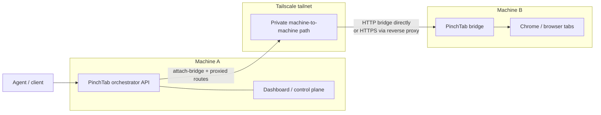

# Tailscale 桥接故事：一个编排器，远程浏览器

有一个简单的分布式 PinchTab 形状，结果非常实用：

- 机器 A 运行 PinchTab 编排器和仪表板
- 机器 B 运行 PinchTab 桥接
- 两台机器通过 Tailscale 连接
- 代理继续与机器 A 通信
- 浏览器工作实际发生在机器 B 上

这为您提供了一个控制平面和多个浏览器执行可以存在的位置。




本文将详细介绍确切的设置、容易犯的错误以及附加远程桥接时 `http` 和 `https` 之间的关键区别。

## 场景

有几种实用的方法可以使用此设置。

### 共享浏览器主机

- 机器 A 运行编排器和仪表板
- 机器 B 运行一个或多个有头桥接
- 用户和代理继续与机器 A 通信
- 真实的浏览器窗口存在于机器 B 上

这是集中浏览器执行而不强制每个用户在本地运行 Chrome 的最简单方法。

### 个人控制平面，远程工作器

- 开发人员在自己的机器上保留编排器
- 第二台机器运行桥接，具有更多 CPU、RAM 或更好的浏览器环境
- 浏览器工作从本地笔记本电脑或台式机移开，但控制保持在本地

当您希望 UI 和控制循环靠近您，但繁重的浏览器工作在其他地方时，这很有用。

### 区域本地执行

- 机器 A 是主控制平面
- 机器 B 更靠近目标网站、API 或内部网络
- 编排器附加桥接并将浏览器工作路由到那里

当延迟、地理位置或网络放置比操作员所在的位置更重要时，这很有用。

### 专用自动化节点

- 一台桥接机器保留用于抓取、PDF 生成、截图或长时间运行的自动化
- 编排器将其作为普通实例附加
- 客户端仍然使用机器 A 上的相同 API 表面

这可以使自动化特定的浏览器负载远离主编排器机器。

### Tailnet 上的有头浏览器池

- tailnet 上的几台机器各自运行一个桥接
- 一个编排器附加它们
- 编排器成为小型远程浏览器集群的单一控制表面

这为您提供了轻量级的分布式浏览器设置，而无需添加完整的远程执行平台。

### HTTPS 前端远程桥接

- 机器 B 运行桥接
- 反向代理或 Tailscale Serve 在其前面终止 TLS
- 编排器通过 `https://` 源附加桥接

当您希望远程桥接作为普通 TLS 端点而不是原始 HTTP 端口可访问时，这很有用。

所有这些场景都有一个共同点：

- 编排器附加到已经运行的桥接
- 它不会在机器 B 上远程启动进程

## 心智模型

控制路径如下：

```text
代理 -> 机器 A 上的编排器 -> 机器 B 上的桥接 -> 机器 B 上的浏览器
```

编排器不会 SSH 到远程机器，也不会启动远程进程。它只是使用以下命令附加到已经运行的 PinchTab 桥接：

```text
POST /instances/attach-bridge
```

附加后，编排器将正常的实例和标签页路由代理到该桥接。

这意味着：

- 客户端只需要知道机器 A
- 机器 A 需要能够到达机器 B
- 机器 B 需要暴露机器 A 可以调用的桥接源

## 为什么 Tailscale 效果很好

Tailscale 非常适合此模型，因为您不需要将桥接发布到公共互联网。

您确实需要桥接在 tailnet 内部可访问，这意味着：

- 桥接不得仅绑定到 `127.0.0.1`
- 远程机器必须允许来自 Tailscale 对等点的所选桥接端口的入站流量
- 编排器必须使用桥接的 Tailscale IP 或 MagicDNS 主机名

不需要正常的 WAN 端口转发。

## 步骤 1：在机器 B 上启动桥接

在机器 B 上，配置并启动桥接，使其在 Tailscale 可访问的地址上监听：

```bash
# 配置网络访问
pinchtab config set server.bind 0.0.0.0
pinchtab config set server.port 9867
pinchtab config set server.token bridge-secret-token

# 启动桥接
pinchtab bridge
```

这种非环回绑定是有文档记录的、非默认的、降低安全性的部署更改。这里是适当的，因为桥接旨在在您的 tailnet 上可访问。保持桥接令牌设置，不要将端口发布到该受控网络边界之外。

如果您使用守护进程或服务管理器，请确保配置文件具有 `bind: "0.0.0.0"`。

第一个常见错误是将桥接保留在默认的 localhost 绑定上。当发生这种情况时：

- `curl http://127.0.0.1:9867/health` 在机器 B 上工作
- `curl http://machine-b.tailnet.ts.net:9867/health` 从机器 A 失败

这不是身份验证失败。这意味着桥接只在 localhost 上监听。

## 步骤 2：证明机器 A 可以到达机器 B

在附加任何内容之前，直接从机器 A 验证桥接：

```bash
curl -H "Authorization: Bearer bridge-secret-token" \
  http://machine-b.tailnet.ts.net:9867/health
```

如果这失败，请在此处停止并首先修复连接。

有用的解释：

- `Connection refused`
  - 机器 A 可以到达机器 B，但该端口上没有任何监听
  - 通常是机器 B 上的端口错误或仅 localhost 绑定
- `401 unauthorized`
  - 连接正确，但令牌错误或缺失
- `200 OK`
  - 桥接可访问并准备附加

## 步骤 3：在机器 A 上配置编排器

远程桥接附件由编排器现有的附加策略管理：

```json
{
  "security": {
    "attach": {
      "enabled": true,
      "allowHosts": [
        "machine-b.tailnet.ts.net"
      ],
      "allowSchemes": [
        "ws",
        "wss",
        "http",
        "https"
      ]
    }
  }
}
```

重要细节：

- `allowHosts` 必须包含您计划在 `baseUrl` 中使用的确切主机名或 IP
- `allowSchemes` 必须包含 `http` 或 `https` 以用于 `attach-bridge`
- `ws` 和 `wss` 仍然与 CDP 附加相关，与桥接附加无关
- `baseUrl` 必须是裸源，例如 `https://bridge-host:9868`；不要包含凭据、查询字符串、片段或路径

使用 `allowHosts: ["*"]` 是有文档记录的、非默认的、降低安全性的覆盖。它禁用主机验证并允许附加到任何具有允许方案的可访问桥接主机。仅在隔离的、操作员控制的网络上使用它。

第二个常见错误是意外地将 `allowHosts` 配置为一个逗号分隔的字符串，而不是真正的 JSON 数组。它必须是：

```json
["machine-b.tailnet.ts.net", "machine-c.tailnet.ts.net"]
```

而不是：

```json
["machine-b.tailnet.ts.net,machine-c.tailnet.ts.net"]
```

更改配置后，重新启动机器 A 上的编排器守护进程。

## 步骤 4：附加桥接

一旦直接健康检查从机器 A 工作，将桥接附加到编排器：

```bash
curl -X POST http://127.0.0.1:9867/instances/attach-bridge \
  -H "Authorization: Bearer orchestrator-token" \
  -H "Content-Type: application/json" \
  -d '{
    "name": "machine-b-bridge",
    "baseUrl": "http://machine-b.tailnet.ts.net:9867",
    "token": "bridge-secret-token"
  }'
```

预期响应形状：

```json
{
  "id": "inst_0a89a5bb",
  "profileId": "prof_278be873",
  "profileName": "machine-b-bridge",
  "port": "",
  "url": "http://machine-b.tailnet.ts.net:9867",
  "status": "running",
  "attached": true,
  "attachType": "bridge"
}
```

这告诉您编排器注册了一个运行中的附加桥接实例，现在将流量路由到它。

## 步骤 5：从机器 A 控制远程浏览器

附加后，客户端继续仅与机器 A 上的编排器通信。

列出实例：

```bash
curl -H "Authorization: Bearer orchestrator-token" \
  http://127.0.0.1:9867/instances
```

在远程桥接上打开标签页：

```bash
curl -X POST http://127.0.0.1:9867/instances/<instanceId>/tabs/open \
  -H "Authorization: Bearer orchestrator-token" \
  -H "Content-Type: application/json" \
  -d '{"url":"https://pinchtab.com"}'
```

通过编排器读取标签页：

```bash
curl -H "Authorization: Bearer orchestrator-token" \
  http://127.0.0.1:9867/tabs/<tabId>/text?format=text
```

这是关键的操作优势：工作在远程发生，但控制点保持在本地和集中。

## HTTP 与 HTTPS

这是最容易引起混淆的部分。

### 直接桥接端口：通常是 HTTP

如果您在配置中使用 `bind: 0.0.0.0` 和 `port: 9867` 启动桥接：

```bash
pinchtab bridge
```

桥接本身通常在该端口上使用纯 HTTP。

这意味着这可以工作：

```bash
http://machine-b.tailnet.ts.net:9867/health
```

而这失败：

```bash
https://machine-b.tailnet.ts.net:9867/health
```

如果您将 `curl` 指向 `https://...:9867` 并收到 TLS 协议错误，这意味着您正在向 HTTP 监听器发送 HTTPS。

### 附件支持 HTTPS

编排器确实支持附加到 `https` 桥接源。

但这只有在桥接前面实际上有 TLS 端点时才有意义，例如：

- Caddy
- Nginx
- Traefik
- Tailscale Serve 或 Funnel

在该设置中，形状是：

```text
https://machine-b.tailnet.ts.net  ->  http://127.0.0.1:9867
```

然后附加请求应使用：

```json
"baseUrl": "https://machine-b.tailnet.ts.net"
```

因此规则是：

- 直接桥接端口：通常是 `http://host:port`
- 反向代理的 TLS 端点：`https://host` 或 `https://host:port`

## 两个独立的令牌

此架构中有两个身份验证跳：

1. 客户端到编排器
2. 编排器到桥接

这意味着您可以使用不同的令牌：

- 用户和代理向机器 A 发送编排器令牌
- 机器 A 向机器 B 发送桥接令牌

客户端在桥接附加后不需要桥接令牌。

## 您获得的好处

此设置为您提供了良好的操作模型：

- 一个编排器可以控制多个远程桥接
- 浏览器执行可以在 tailnet 中的不同机器上发生
- 客户端、仪表板和代理不需要知道每个浏览器在哪里运行
- 即使执行是远程的，实例和标签页路由也保持一致

这是远程桥接附件的真正价值：您可以将浏览器工作移动到正确的机器，而无需更改代理使用的控制表面。

## 故障排除清单

如果附件失败，请按顺序执行此清单：

1. 机器 A 可以直接到达 `baseUrl/health` 吗？
2. 机器 B 是否绑定到 `0.0.0.0` 而不仅仅是 `127.0.0.1`？
3. 桥接是否真的在您认为的端口上监听？
4. 桥接是否需要令牌，您是否发送了正确的令牌？
5. 机器 A 的 `allowHosts` 是否包含您在 `baseUrl` 中使用的确切主机？
6. 机器 A 的 `allowSchemes` 是否包含 `http` 或 `https`？
7. 您是否对直接桥接端口使用 `http`，仅对真实 TLS 端点使用 `https`？

一旦这些正确，`attach-bridge` 就会成为一个简单的注册步骤，而不是网络难题。